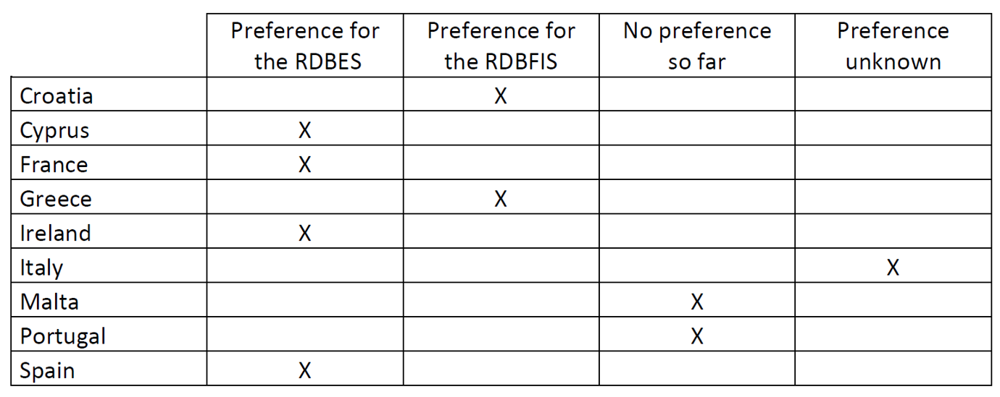
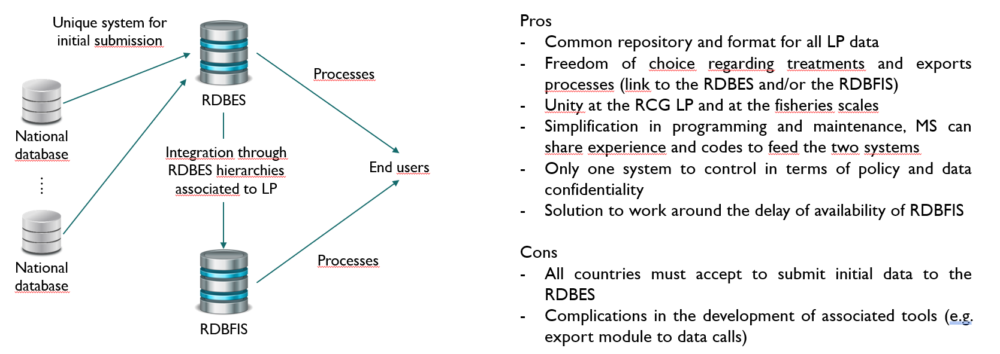
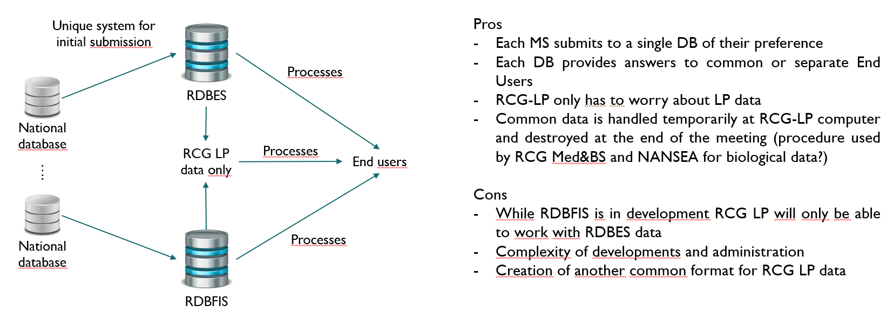
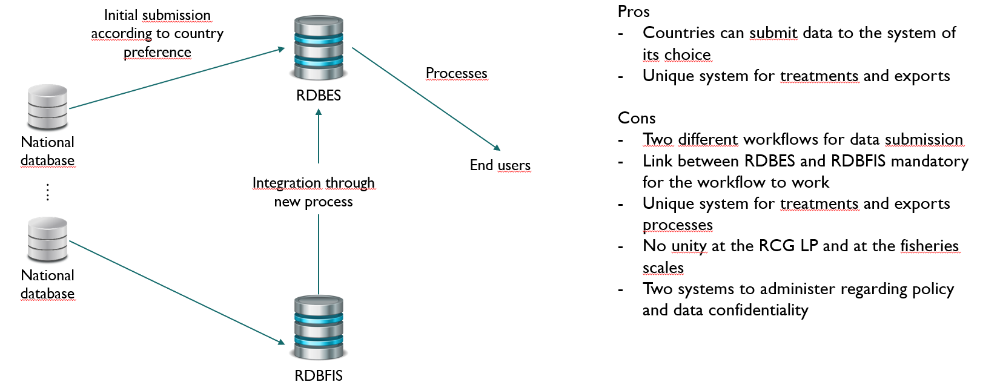
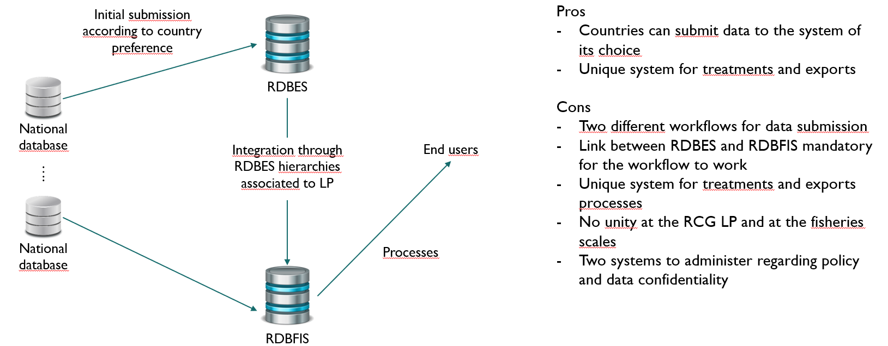

## En réalité, que s'est-il passé ? {.smaller}

### [**Historique des discussions au RCG LP sur le développement d'une RDB**]{style="color:#00a9d6"}

-   Discussions depuis [**2016-2017**]{style="color:#9a1c1f"} durant les réunions annuelles
    -   Présentation du [**RDBES**]{style="color:#9a1c1f"} en 2018
    -   Beaucoup de [**questions en suspens**]{style="color:#9a1c1f"} sur des sujets sensibles
        -   [**confidentialité**]{style="color:#9a1c1f"} des données
        -   [**hébergement**]{style="color:#9a1c1f"} de la base de données
        -   [**financement**]{style="color:#9a1c1f"} du développement et de l'administration
-   En [**2020**]{style="color:#9a1c1f"}, recommandation de rejoindre l'équipe de développement du RDBES et de l'utiliser comme RDB pour les grands pélagiques
    -   Rejet de cette recommandation lors de la réunion de validation

## 2021, on continue... {.smaller}

### [**Toujours les mêmes questions en suspens**]{style="color:#00a9d6"}

-   Prise de conscience de la nécessité d'avoir [**plus**]{style="color:#9a1c1f"} de discussion sur ce sujet pour avancer
    -   Lancement du projet du [**RDBFIS**]{style="color:#9a1c1f"}
    -   création d'un [**sous-groupe de travail**]{style="color:#9a1c1f"} dédié à ce sujet
    -   intégration de toutes les [**parties prenantes**]{style="color:#9a1c1f"} dans ce sous-groupe (les 9 pays impliqués dans le RCG LP, mais aussi les utilisateurs finaux et personnes impliquées dans le RDBES et RDFIS)
    -   objectifs de définir les [**besoins**]{style="color:#9a1c1f"} et [**spécificités**]{style="color:#9a1c1f"} de chacun
    -   définition de [**scenarii**]{style="color:#9a1c1f"}

## Définition des préférences de chacun

## Scenario 1

## Scenario 2

## Scenario 3

## Scenario 4

