#  {background-image="images/front_page.png"}

[Exploited Tropical Pelagic Ecosystems Observatory]{style="color:#ffffff; font-size: 2em"}

[An information system for the collection, storage, processing and dissemination of various data (fisheries, on-board observers, VMS, surveys, etc.)]{style="color:#ffffff; font-size: 1.25em"}

[Mathieu Depetris (mathieu.depetris\@ird.fr)]{style="color:#ffffff; font-size: 0.75em"} <br/> [Antoine Duparc (antoine.duparc\@ird.fr)]{style="color:#ffffff; font-size: 0.75em"} <br/> [Laurent Floc'h (laurent.floch.ird.fr)]{style="color:#ffffff; font-size: 0.75em"} <br/> [Esther Mollier (esther.mollier\@ird.fr)]{style="color:#ffffff; font-size: 0.75em"} <br/><br/><br/> [© FADIO / IRD - Ifremer]{style="color:#ffffff; font-size: 0.4em"}

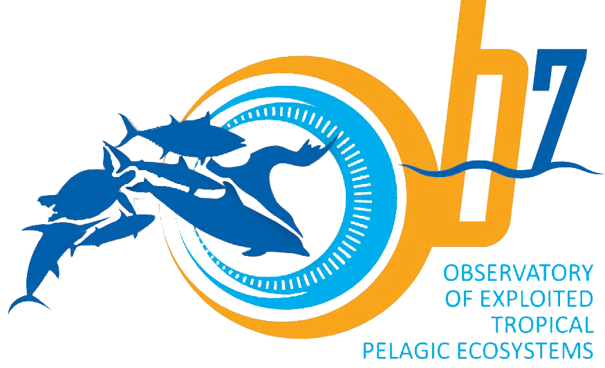{.absolute top="510" width="10%"} 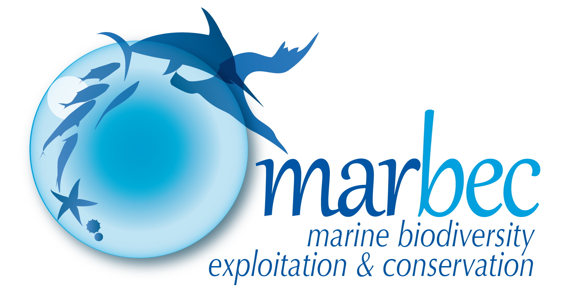{.absolute top="515" left="150" width="12%"} 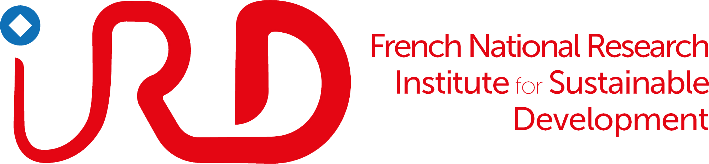{.absolute top="530" left="300" width="14%"}

# Introduction

[What is the Exploited Tropical Pelagic Ecosystems Observatory? (Ob7)]{style="color:#00a9d6; font-size: 1.5em"}

## What is exactly?

::: columns
::: {.column width="40%"}
-   Four components
    -   An "[**observatory**]{style="color:#9a1c1f"}"
    -   Several "[**ecosystems**]{style="color:#9a1c1f"}"
    -   "[**tropical pelagic**]{style="color:#9a1c1f"}"
    -   "[**exploited**]{style="color:#9a1c1f"}"
:::

::: {.column width="60%"}
{width="70%"}
:::
:::

## An "observatory" {.smaller}

-   If we take a look to the definitions
    -   "establishment specialising in astronomical, meteorological or volcanic studies"
    -   "observation post located generally in a elevated position"
    -   "a structure responsible for observing economic, political or social events"
-   Ob7 is another thing !
    -   It is a [**set of resources**]{style="color:#9a1c1f"} (human and material) under the umbrella of the [**French National Research Institute for Sustainable Development**]{style="color:#9a1c1f"}
        -   Created in [**2000**]{style="color:#9a1c1f"} under the name of [**OSIRIS**]{style="color:#9a1c1f"} ("observatoires et systèmes d'information des pêches tropicales")
        -   Became in [**2005**]{style="color:#9a1c1f"} "[**l'Observatoire Thonier**]{style="color:#9a1c1f"}"
        -   Since [**2016**]{style="color:#9a1c1f"} the [**Ob7**]{style="color:#9a1c1f"} for Exploited Tropical Pelagic Ecosystems Observatory, under the responsability of Julien Lebranchu (julien.lebranchu\@ird.fr)

## Several "ecosystems"

::: columns
::: {.column width="50%"}
-   What is an ecosystems ?

"system formed by an environment ([**biotope**]{style="color:#9a1c1f"}) and by all the species ([**biocenosis**]{style="color:#9a1c1f"}) that live, feed and reproduce there"
:::

::: {.column width="50%"}
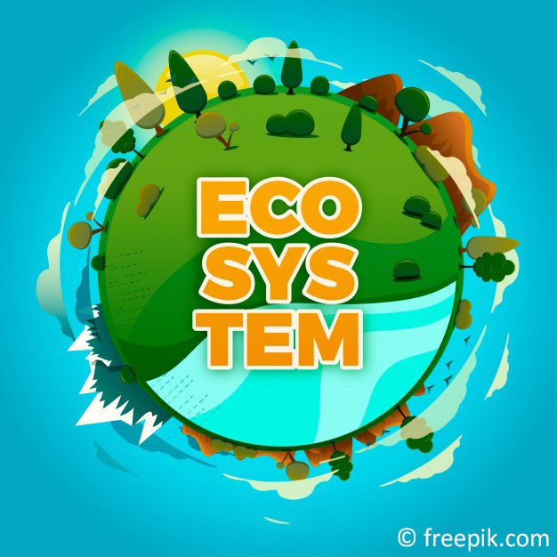{width="60%"}
:::
:::

## "Tropical pelagic" {.smaller}

::: columns
::: {.column width="50%"}
-   [**Pelagic**]{style="color:#9a1c1f"} area

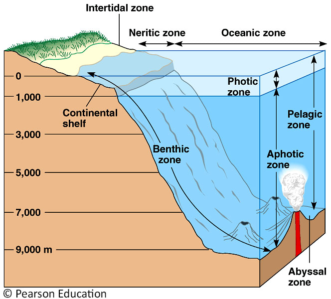{width="60%"}
:::

::: {.column width="50%"}
-   [**Tropical**]{style="color:#9a1c1f"} area

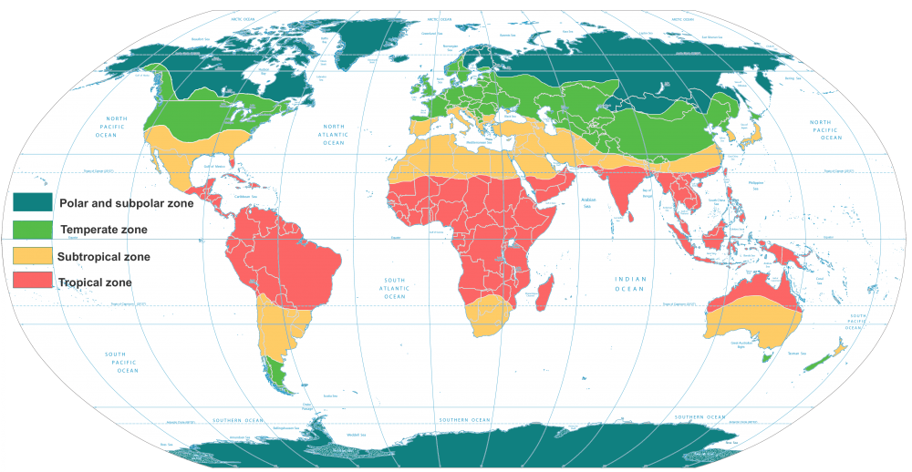
:::
:::

## "Exploited" {.smaller}

-   Human exploitation
-   Related to the halieutic ressources = [**fisheries**]{style="color:#9a1c1f"}

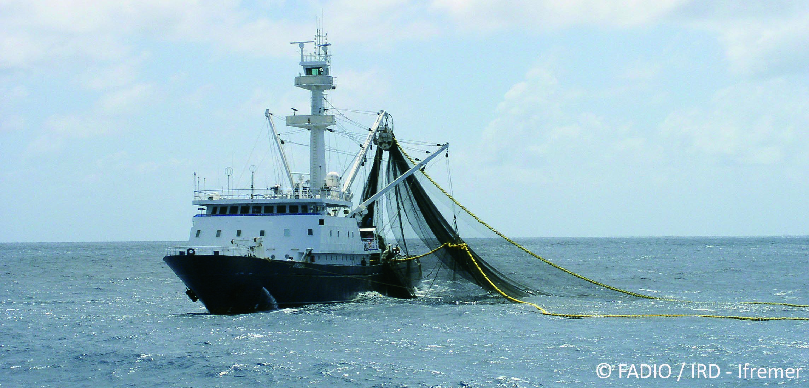

## To summarise {.smaller}

### [**And move forward**]{style="color:#00a9d6"}

-   The Exploited Tropical Pelagic Ecosystems Observatory is a set of resources, [**humans**]{style="color:#9a1c1f"} and [**materials**]{style="color:#9a1c1f"}, under the umbrella of the French IRD
-   Its aims are to [**collecting**]{style="color:#9a1c1f"}, [**storing**]{style="color:#9a1c1f"}, [**processing**]{style="color:#9a1c1f"} and [**sharing**]{style="color:#9a1c1f"} data focusing on the French tuna fisheries in the Atlantic and Indian Oceans
-   Furthermore, he provides support and expertise among the [**RFMO**]{style="color:#9a1c1f"}s ([**R**]{style="color:#9a1c1f"}egional [**F**]{style="color:#9a1c1f"}isheries [**M**]{style="color:#9a1c1f"}anagement [**O**]{style="color:#9a1c1f"}rganisations) and [**partners**]{style="color:#9a1c1f"} (Spanish Institute of Oceanography, Seychelles Fishing Authority, ...)

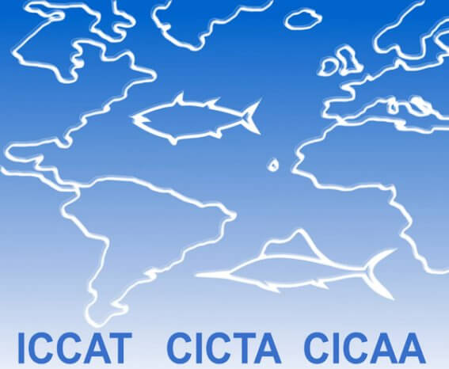{.absolute top="400" left="50" width="15%"} 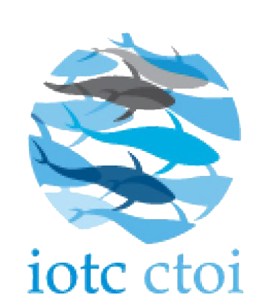{.absolute top="400" left="350" width="11%"} 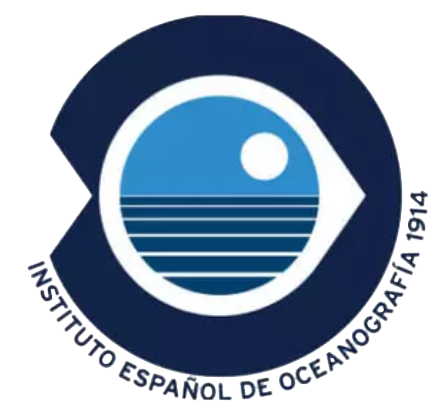{.absolute top="400" left="600" width="14%"} 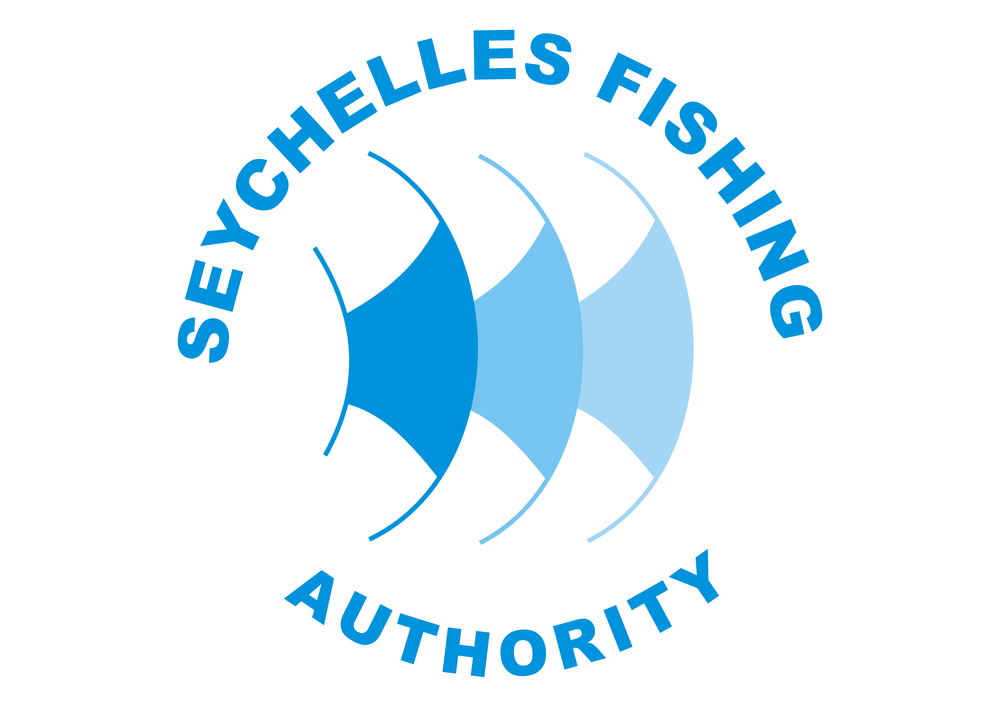{.absolute top="400" left="850" width="18%"}

# Targeted species and fishing technics

[Major tunas, bycatch, floating objects and co.]{style="color:#00a9d6; font-size: 1.5em"}

## Major tunas

-   Yellowfin tuna (YFT, *Thunnus albacares*) 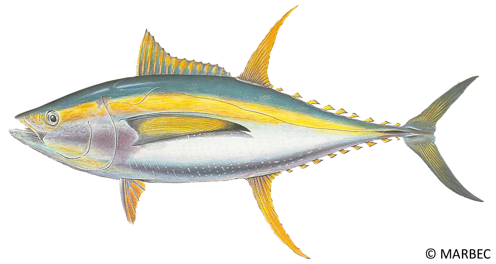{.absolute top="40" left="750" width="25%"} <br/> <br/> <br/>
-   Bigeye tuna (BET, *Thunnus obesus*) 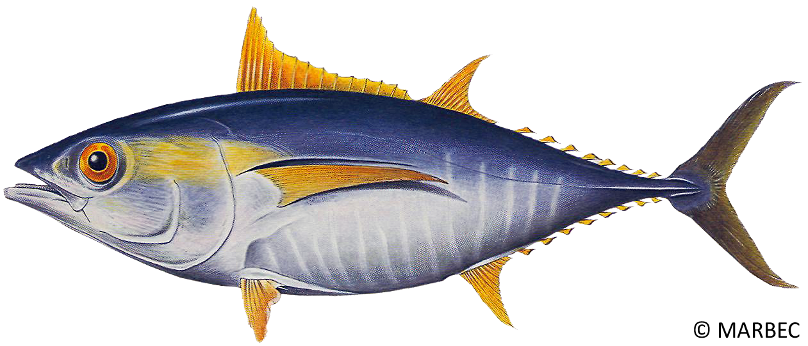{.absolute top="175" left="550" width="25%"} <br/> <br/> <br/>
-   Skipjack tuna (SKJ, *Katsuwonus pelamis*) 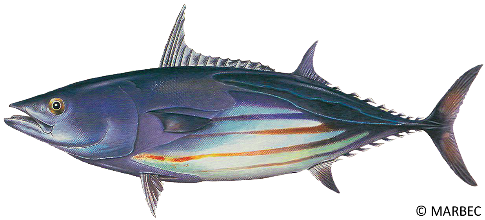{.absolute top="295" left="725" width="25%"} <br/> <br/> <br/>
-   Albacore tuna (ALB, *Thunnus alalunga*) 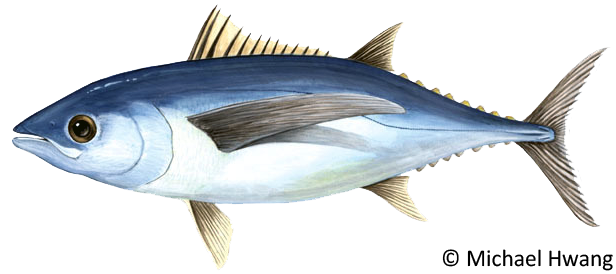{.absolute top="435" left="550" width="25%"}

## Bycatch species part 1

### [**Minor tunas (neritic and thazards)**]{style="color:#00a9d6"}

-   bullet tuna (FRI, *auxis rochei*) 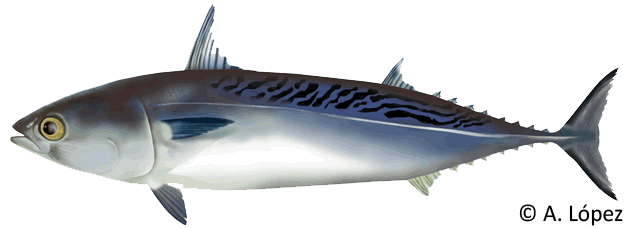{.absolute top="125" left="500" width="25%"} <br/> <br/>
-   king mackerel (KGM, *scomberomorus cavalla*) 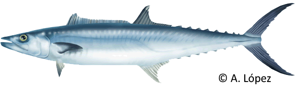{.absolute top="230" left="700" width="25%"} <br/> <br/>
-   atlantic bonito (BON, *sarda sarda*) 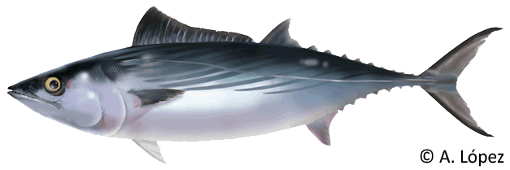{.absolute top="315" left="725" width="25%"} <br/> <br/>
-   frigate tuna (LTA, *auxis thazard*) 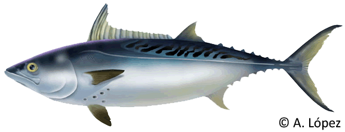{.absolute top="405" left="550" width="25%"}

## Bycatch species part 2

### [**Billfish and pelagic sharks species**]{style="color:#00a9d6"}

-   swordfish (SWO, *xiphias gladius*) 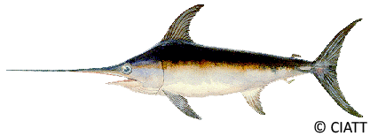{.absolute top="135" left="550" width="25%"} <br/> <br/>
-   sailfish (SAI, *istiophorus albicans*) 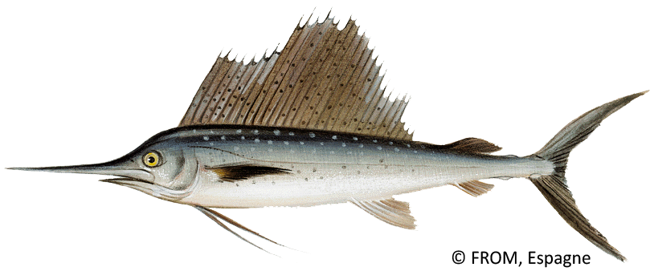{.absolute top="215" left="450" width="25%"} <br/> <br/>
-   blue shark (BSH, *prionace glauca*) 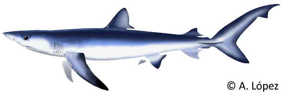{.absolute top="325" left="650" width="25%"} <br/> <br/>
-   portbeagle shark (POR, *lamna nasus*) 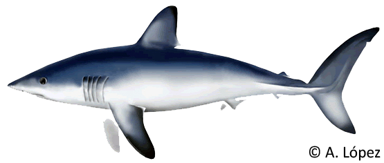{.absolute top="395" left="525" width="25%"} <br/> <br/>
-   ...

## Three fishing technics part 1

### [**Bait boat**]{style="color:#00a9d6"}

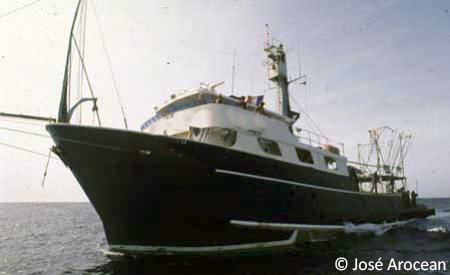{.absolute top="150" left="0" width="45%"} 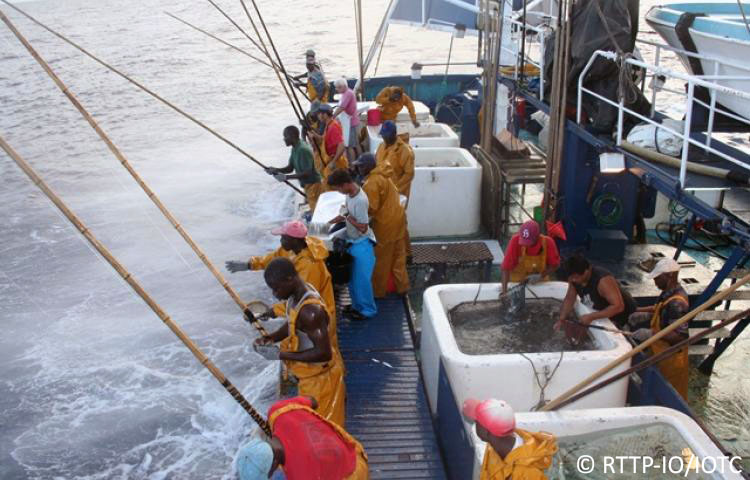{.absolute top="350" left="500" width="45%"}

## Three fishing technics part 2

### [**Longlines**]{style="color:#00a9d6"}

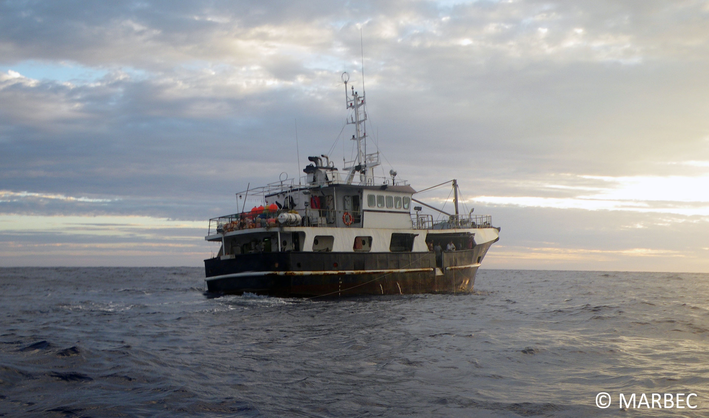{.absolute top="150" left="0" width="45%"} 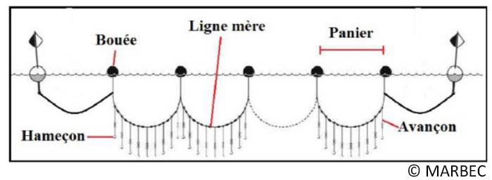{.absolute top="450" left="500" width="50%"}

## Three fishing technics part 3

### [**Purse seiner**]{style="color:#00a9d6"}

{.absolute top="150" left="0" width="45%"} 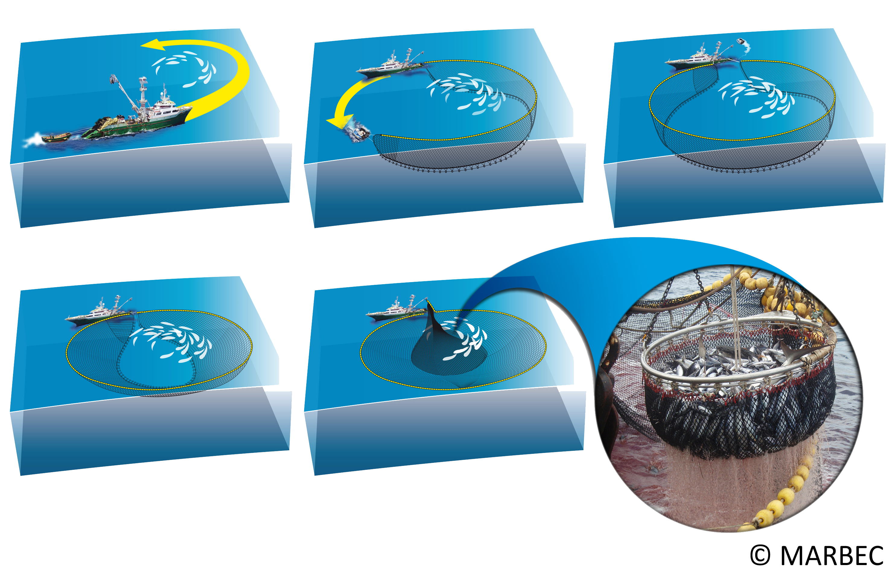{.absolute top="300" left="500" width="45%"}

## Two fishing schools

### [**Free fishing school or floating object**]{style="color:#00a9d6"}

-   FOBs: [**F**]{style="color:#9a1c1f"}loating [**OB**]{style="color:#9a1c1f"}jects
    -   [**natural**]{style="color:#9a1c1f"} or [**artificial**]{style="color:#9a1c1f"}

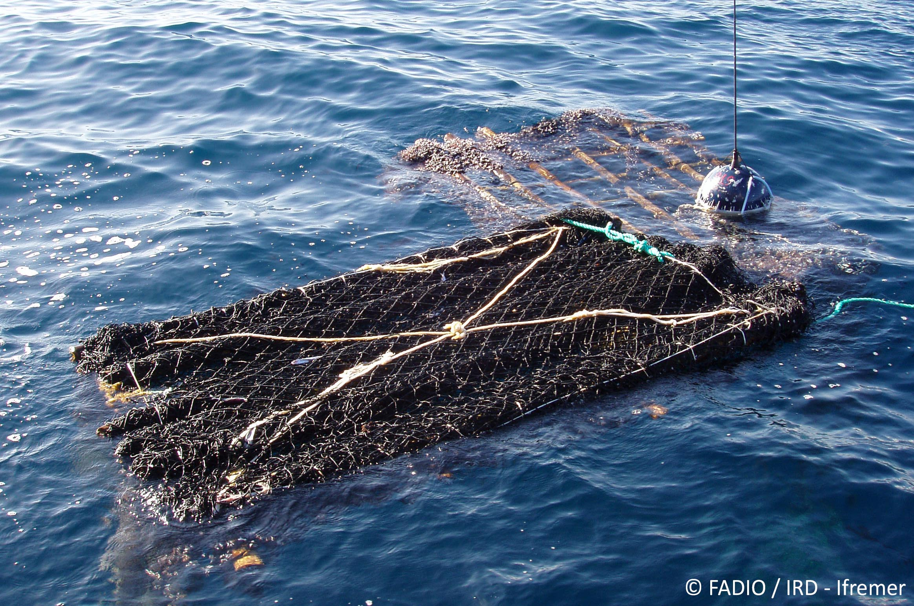{.absolute top="350" left="0" width="30%"} 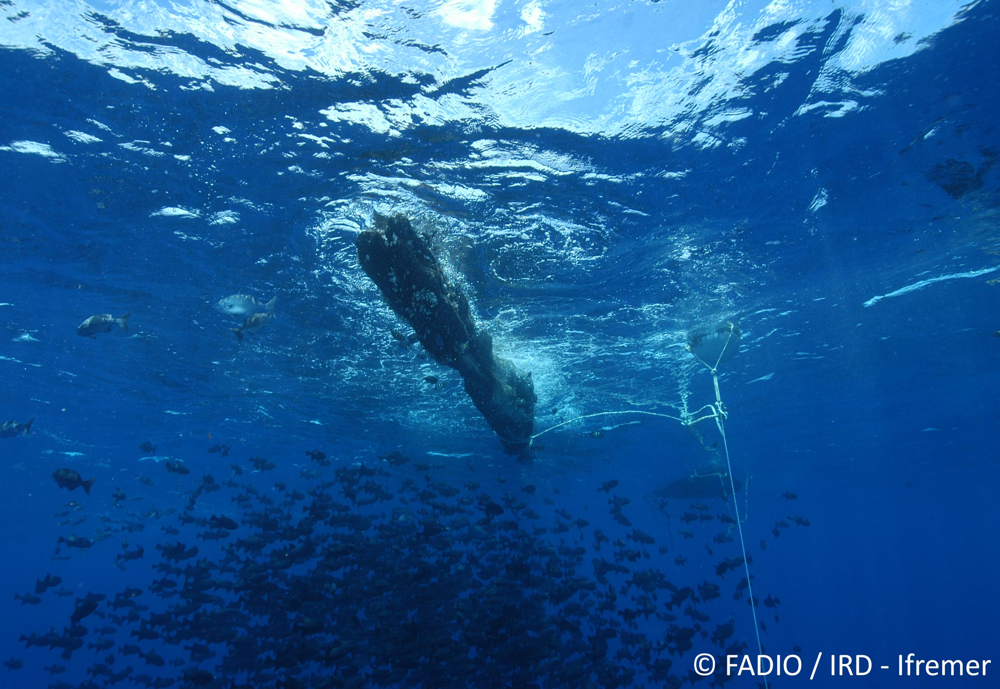{.absolute top="300" left="350" width="30%"} 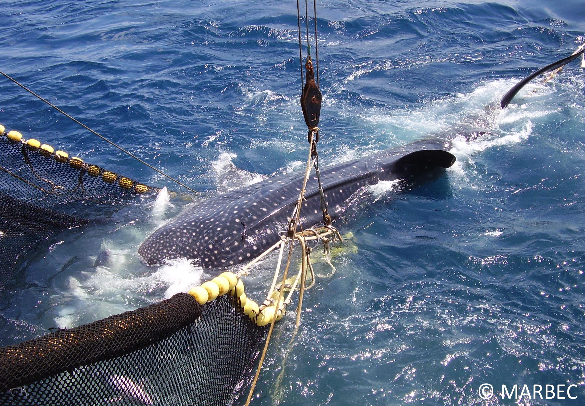{.absolute top="340" left="700" width="30%"}

# Observatory's aims

[Why do we need this kind of structure?]{style="color:#00a9d6; font-size: 1.5em"}

## Why we need an observatory? {.smaller}

### [**Collection, storage, treatment and sharing of data**]{style="color:#00a9d6"}

-   Each country exploiting fisheries resources must declare its activities
    -   What does that mean?
        -   [**Transversal variables**]{style="color:#9a1c1f"}: effort, capacity and capture
    -   To whom and why?
        -   [**European Commission**]{style="color:#9a1c1f"} (if EU member, used for example regarding fisheries agreements) and [**RFMOs**]{style="color:#9a1c1f"} (population dynamics)
-   [**RFMOs**]{style="color:#9a1c1f"} ([**R**]{style="color:#9a1c1f"}egional [**F**]{style="color:#9a1c1f"}isheries [**M**]{style="color:#9a1c1f"}anagement [**O**]{style="color:#9a1c1f"}rganisations): area and associated species
-   These organisations are composed of the [**coastal countries**]{style="color:#9a1c1f"} of the region concerned and [**countries with fisheries interests**]{style="color:#9a1c1f"} in the region
-   [**Advisory**]{style="color:#9a1c1f"} capacity, but also capacity to [**define**]{style="color:#9a1c1f"} technical measures and obligations
    -   [**Recommendations**]{style="color:#9a1c1f"} and [**resolutions**]{style="color:#9a1c1f"}

## RFMOs areas of interest? {.smaller}

### [**For large pelagics, 5 RFMOs**]{style="color:#00a9d6"}

::: columns
::: {.column width="80%"}
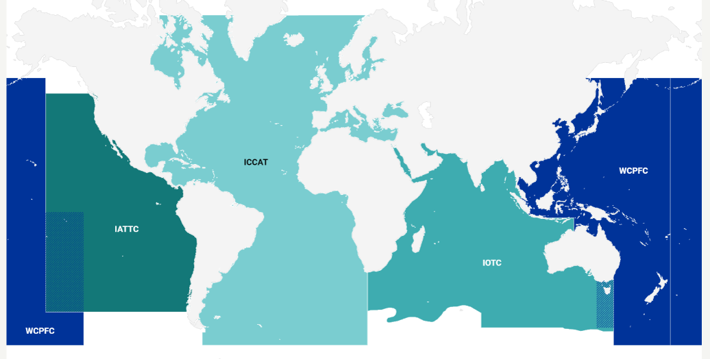{width="80%"}
:::

::: {.column width="20%"}
The International Commission for the Conservation of Atlantic Tunas {.absolute top="150" left="730" width="8%"} <br/> <br/> The Indian Ocean Tuna Commission {.absolute top="250" left="730" width="8%"} <br/> <br/> Inter-American Tropical Tuna Commission 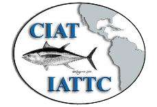{.absolute top="380" left="730" width="8%"} <br/> <br/> The Western and Central Pacific Fisheries Commission 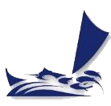{.absolute top="470" left="730" width="8%"}
:::
:::

## Rotation around 4 axes

### [**Collection, storage, treatment and sharing of data**]{style="color:#00a9d6"}

-   [**Collection**]{style="color:#9a1c1f"}: recovery of declarative data (logbook for example), sampling, fleet characteristics, etc.
-   [**Storage**]{style="color:#9a1c1f"}: management in databases and administration of these databases
-   [**Treatment**]{style="color:#9a1c1f"}: processes of checking/correcting data to ensure quality data with the least possible bias or specific exploitation
-   [**Sharing**]{style="color:#9a1c1f"}: expertise and coordination at several levels, for research projects, in support of stock assessments, data delivery, etc.

## One specific characteristic {.smaller}

### [**Focus on the European Union (EU) in these processes**]{style="color:#00a9d6"}

::: columns
::: {.column width="70%"}
-   Normal each entity negotiates [**on its side**]{style="color:#9a1c1f"} and is responsible for providing data
-   For the EU member states it [**coordinates**]{style="color:#9a1c1f"} all these tasks
    -   Intermediary with [**RFMOs**]{style="color:#9a1c1f"}
    -   For France: [**DGAMPA**]{style="color:#9a1c1f"} ("Direction générale des affaires maritimes, de la pêche et de l'aquaculture") then [**DGMARE**]{style="color:#9a1c1f"} (European Commission Directorate-General Maritime Affairs and Fisheries) then [**RFMOs**]{style="color:#9a1c1f"}
-   The EU guarantees the monitoring of the fishing quota(s) by European fishermen
-   Gives you more [**impact**]{style="color:#9a1c1f"} on the international scene
:::

::: {.column width="30%"}
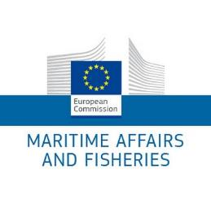{.absolute top="150" left="850" width="10%"} 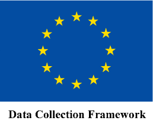{.absolute top="300" left="850" width="10%"}
:::
:::

# Ob7 design

[The Information System, the heart of the observatory]{style="color:#00a9d6; font-size: 1.5em"}

## The heart of the observatory

### [**The Information System: all human and material resources**]{style="color:#00a9d6"}

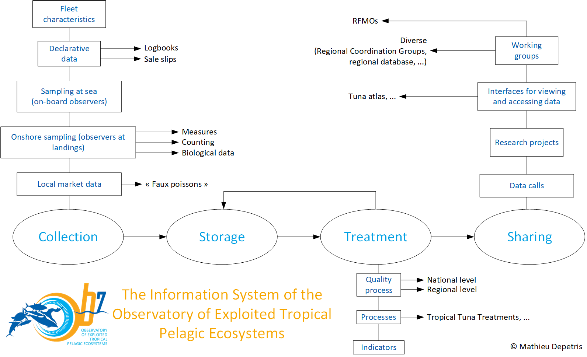{.absolute left="175" width="60%"}

# Data collection

[Fleet characteristics, declarative data, onboard and onshore sampling]{style="color:#00a9d6; font-size: 1.5em"}

## Data collection part 1

### [**Fleet characteristics and declarative data**]{style="color:#00a9d6"}

::: columns
::: {.column width="40%"}
-   Fleet [**characteristics**]{style="color:#9a1c1f"}: type of boat, size, active boat, etc.
-   [**Declarative**]{style="color:#9a1c1f"} data
    -   Logbooks and sale slips
:::

::: {.column width="60%"}
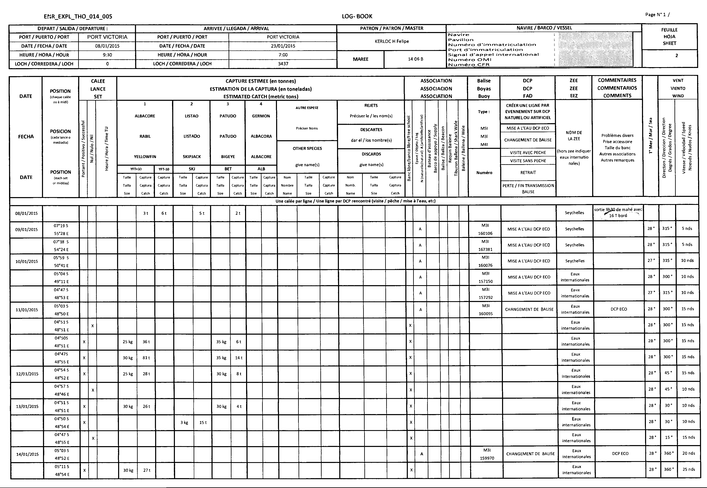
:::
:::

## Data collection part 2

### [**Onboard sampling**]{style="color:#00a9d6"}

-   Sampling at sea: [**on-board observers**]{style="color:#9a1c1f"}
-   Priority collection of information on [**discards**]{style="color:#9a1c1f"} and [**bycatch species**]{style="color:#9a1c1f"}

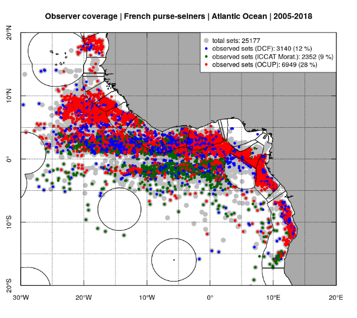{.absolute top="275" left="50" width="40%"} 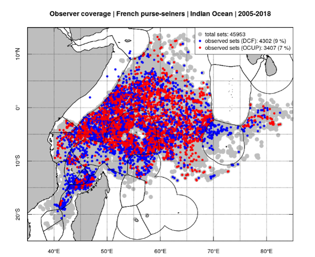{.absolute top="285" left="500" width="40%"}

## Data collection part 3

### [**Example of bycatch**]{style="color:#00a9d6"}

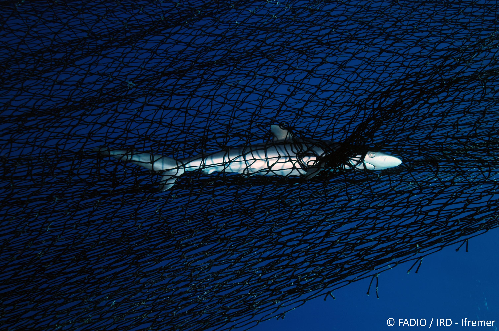{.absolute top="150" left="50" width="35%"} 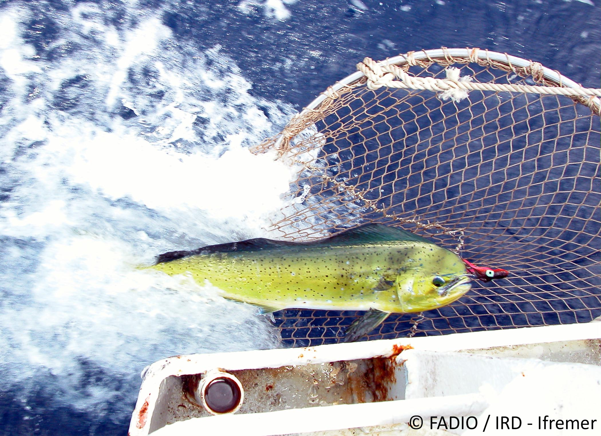{.absolute top="410" left="240" width="35%"} 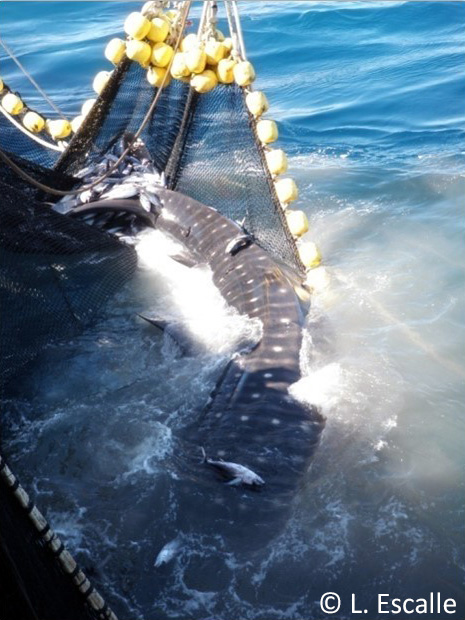{.absolute top="150" left="650" width="35%"}

## Data collection part 4

### [**Onshore sampling**]{style="color:#00a9d6"}

-   Onshore sampling: observers at ports during [**landings**]{style="color:#9a1c1f"}
-   Sampling plan based on the [**well plan**]{style="color:#9a1c1f"}
    -   A catch (= [**set**]{style="color:#9a1c1f"}) is stored in one or more wells
-   Individuals [**measurement**]{style="color:#9a1c1f"} and [**counting**]{style="color:#9a1c1f"}
-   Collection of [**biological data**]{style="color:#9a1c1f"}: stomach contents, otolith, gonads, etc.

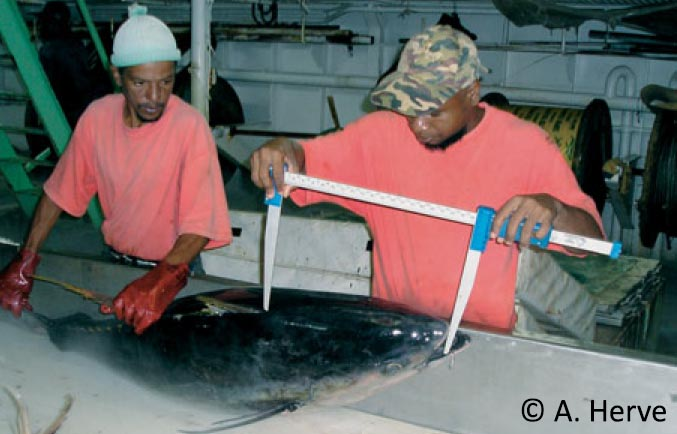{.absolute top="430" left="50" width="35%"} 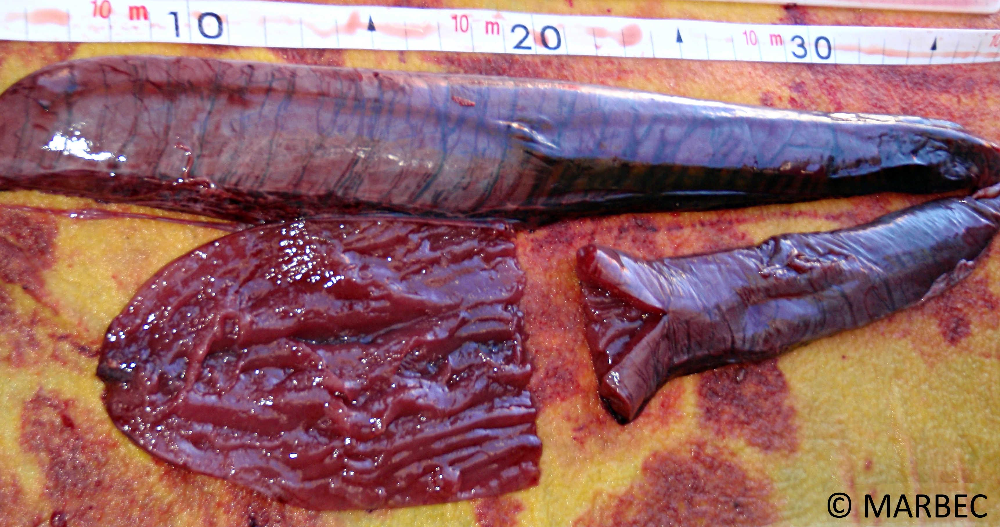{.absolute top="445" left="550" width="35%"}

# Ob7's Information System

[Storage and treatment]{style="color:#00a9d6; font-size: 1.5em"}

## The Information System

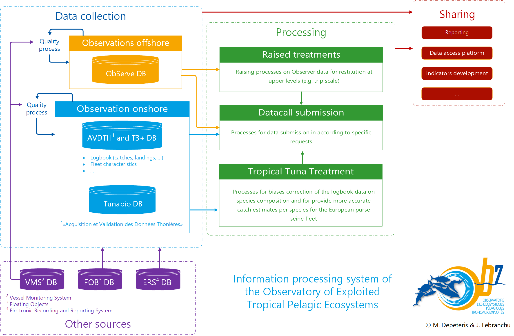{.absolute top="100" left="75" width="75%"}

## Data administration

-   Administration of a [**database management system**]{style="color:#9a1c1f"}
    -   Design and programming operations for the collection, storage, processing and restitution
-   Ensure data quality, [**identify**]{style="color:#9a1c1f"} and [**correct**]{style="color:#9a1c1f"} errors
-   Ensure data [**security**]{style="color:#9a1c1f"} and [**integrity**]{style="color:#9a1c1f"}
-   Ensure that data confidentiality is [**respected**]{style="color:#9a1c1f"}

## Data quality {.smaller}

### [A lot of constraints]{style="color:#00a9d6"}

-   [**During**]{style="color:#9a1c1f"} the database design
    -   Referential Integrity Constraints: ensuring that data is consistent with a reference list
    -   Unity constraint: to avoid duplication
    -   Type constraints: integer, real,...
-   [**Pre-checks**]{style="color:#9a1c1f"}
    -   Check the data before integration in the database (example allow catch declarations only if a fishing trip has been successfully completed)
-   [**Post-checks**]{style="color:#9a1c1f"}
    -   Checking the data after entry
    -   Limit the length of the sample sizes to realistic values
    -   Check the consistency of the fishing season: missing days, same end date between the different sources

## Data security {.smaller}

-   [**Safety**]{style="color:#9a1c1f"} aims to protect against catastrophic failures
-   [**Confidentiality security**]{style="color:#9a1c1f"} corresponds to the prevention of unauthorised access or manipulation of information and concerns the fight against intentional faults (viruses, Trojan horses, etc.)
-   For the [**operating system**]{style="color:#9a1c1f"}
    -   Fault-tolerant disks: RAID, Redundant Array of Independent Disks, secure data in real time
    -   Backup to external media in another location
-   For [**Database**]{style="color:#9a1c1f"}
    -   Username/password
    -   Definition of read/write access rights
-   For [**Network**]{style="color:#9a1c1f"}
    -   VPN (Virtual Private Network)
    -   IP-based access control. Encryption of network exchanges

## Data, Information, Knowledge, Wisdom (DIKW) Pyramid

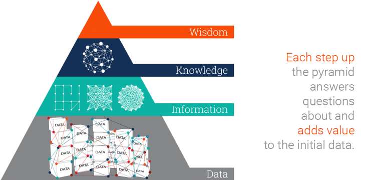{.absolute left="125" width="80%"}

# Data sharing

[Data calls, expertise, coordination, projects and working groups]{style="color:#00a9d6; font-size: 1.5em"}

## Data deliveries

### [Data calls]{style="color:#00a9d6"}

-   For diverse projects (research, internships ...)
-   For the [**DGAMPA**]{style="color:#9a1c1f"} (Direction générale des affaires maritimes, de la pêche et de l'aquaculture)
    -   For [**France**]{style="color:#9a1c1f"} (National Work Plan ...)
    -   For the European Union ([**F**]{style="color:#9a1c1f"}isheries [**D**]{style="color:#9a1c1f"}ependent [**I**]{style="color:#9a1c1f"}nformation, ...)
-   For [**RFMOs**]{style="color:#9a1c1f"}
    -   Delivery of [**transversal variables**]{style="color:#9a1c1f"} (June-July for year n-1 data)
    -   Specific formats

## Expertise

### [RFMO working groups]{style="color:#00a9d6"}

-   The [**I**]{style="color:#9a1c1f"}nternational [**C**]{style="color:#9a1c1f"}ommission for the [**C**]{style="color:#9a1c1f"}onservation of [**A**]{style="color:#9a1c1f"}tlantic [**T**]{style="color:#9a1c1f"}unas {.absolute top="150" left="915" width="8%"} <br/> <br/>
-   The [**I**]{style="color:#9a1c1f"}ndian [**O**]{style="color:#9a1c1f"}cean [**T**]{style="color:#9a1c1f"}una [**C**]{style="color:#9a1c1f"}ommission {.absolute top="230" left="500" width="8%"} <br/> <br/>
-   To simplify, [**3 levels of actions**]{style="color:#9a1c1f"}:
    -   The Working Groups
    -   The Scientific Committee
    -   The Commission 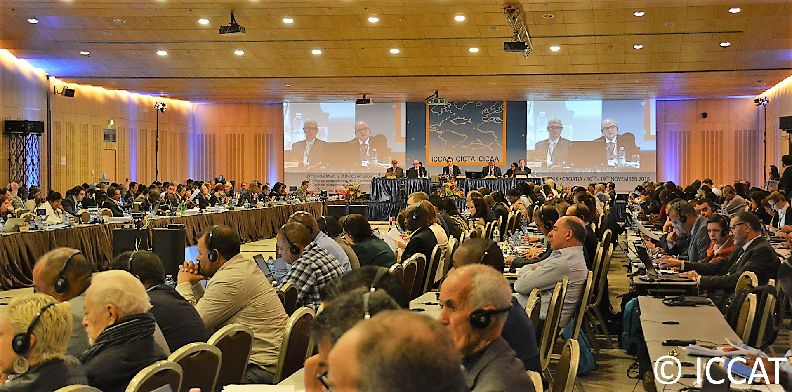{.absolute top="375" left="500" width="45%"}

## Coordination

### [At EU scale]{style="color:#00a9d6"}

-   [**R**]{style="color:#9a1c1f"}egional [**C**]{style="color:#9a1c1f"}oordination [**G**]{style="color:#9a1c1f"}roups
    -   [**Main hub**]{style="color:#9a1c1f"} for regional coordination and cooperation within the different regions contributing to the fisheries Data Collection Framework
    -   Consist of experts appointed by Member States, including MS' national correspondents for data collection, and the EU Commission.
    -   [**Continuous**]{style="color:#9a1c1f"} process
    -   Ob7 are involve in the RCG Large Pelagics<br/> [(https://www.fisheries-rcg.eu/rcg-lp/)](https://www.fisheries-rcg.eu/rcg-lp/){target="_blank"}
-   The aim is to move from a [**"national"**]{style="color:#9a1c1f"} to a [**"regional"**]{style="color:#9a1c1f"} level.

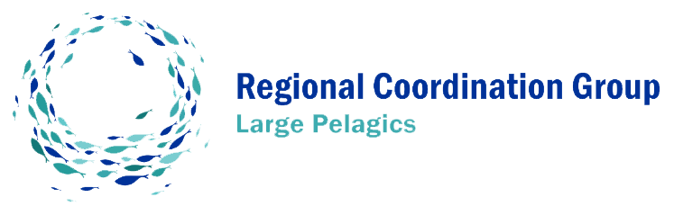{.absolute top="415" left="700" width="30%"}

## Research support

### [Projects]{style="color:#00a9d6"}

::: columns
::: {.column width="70%"}
-   Project FISHN'CO: Strengthening EU-MAP data collection by developing Regional Work Plans for the Regional Coordination Groups (RCG) NA NS & EA, Baltic and Large Pelagics and Economics Issues.<br/> [https://www.fisheries-rcg.eu/fishnco/](https://www.fisheries-rcg.eu/fishnco/){target="_blank"}
-   Project SECWEB: Developing mechanisms to support the planning and execution of administrative tasks and the branding and online visibility of the Regional Coordination Groups (RCGs), with the aim to establish a long-term supportive structure (SECWEB).<br/> [https://www.fisheries-rcg.eu/secweb/](https://www.fisheries-rcg.eu/secweb/){target="_blank"}
:::

::: {.column width="30%"}
{.absolute top="230" left="800" width="23%"} 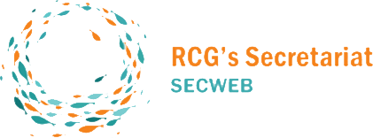{.absolute top="415" left="800" width="23%"}
:::
:::

## Other topics

### [Development of a regional database for large pelagics]{style="color:#00a9d6"}

-   [**R**]{style="color:#9a1c1f"}egional [**D**]{style="color:#9a1c1f"}atabase & [**E**]{style="color:#9a1c1f"}stimation [**S**]{style="color:#9a1c1f"}ystem (RDBES, [https://sboxrdbes.ices.dk/](https://sboxrdbes.ices.dk/#/){target="_blank"})

-   Regional database for the Mediterranean and Black Seas ([**Med&BS RDBFIS**]{style="color:#9a1c1f"}, [https://medbsrdb.eu/](https://medbsrdb.eu/){target="_blank"})

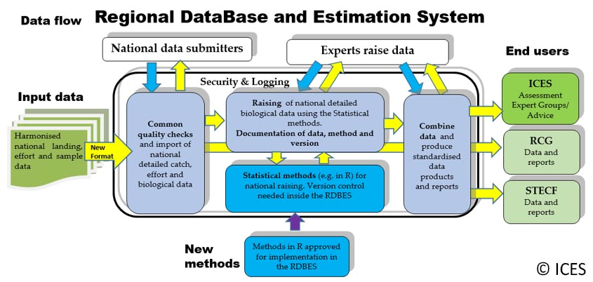{.absolute top="325" left="200" width="60%"}

# A case study

[The onshore data collection]{style="color:#00a9d6; font-size: 1.5em"}

## Background {.smaller}

### [Why we need to collect onshore data?]{style="color:#00a9d6"}

-   [**Need of data**]{style="color:#9a1c1f"}
    -   for compliance (IOTC Res. 15/01 and 15/02)
        -   yearly catch data by species
        -   Gridded catch data at a resolution 1° by month
    -   for scientific purposes (stock assessment)
        -   Catches (fishing effort)
        -   Biological parameters (biometry, reproduction status, etc.)
-   [**Provide quality data**]{style="color:#9a1c1f"}
    -   Data independence: limiting conflict of interest between fishing business and regulation
    -   Minimize biases: crew estimations reported in logbook are biased

## Sampling schema {.smaller}

### [Description and design]{style="color:#00a9d6"}

-   Data collection onshore [**began**]{style="color:#9a1c1f"} in the 60's and was [**standardized**]{style="color:#9a1c1f"} in the 90's
-   [**Objectives**]{style="color:#9a1c1f"}: Estimation catch characteristics of the purse seine fisheries
    -   Nominal catch by species
    -   Catch and effort: catch by species by 1° square/month
    -   Size distribution of the catch
-   [**Target population**]{style="color:#9a1c1f"}: major tropical tuna exploited stock by purse and and baitboat fisheries
-   [**Region**]{style="color:#9a1c1f"}: Atlantic and Indian ocean
-   [**Sample area**]{style="color:#9a1c1f"}: ICCAT and IOTC fishing ground
-   Only [**main ports**]{style="color:#9a1c1f"} are covered (Abidjan, Dakara and Victoria)
-   [**Primary sample unit**]{style="color:#9a1c1f"}: landing

## Sampling constraints {.smaller}

### [Onshore VS onboard]{style="color:#00a9d6"}

::: columns
::: {.column width="70%"}
```{r}
knitr::kable(data.frame("Key points for the collect" = c("Human cost",
                                                         "Collect location",
                                                         "Sampling period",
                                                         "Sampling point",
                                                         "Sampling easiness",
                                                         "Other program link/conflict"),
                        "Onshore" = c("Sample team at port",
                                      "Few number of landing ports",
                                      "At landing (3-5 days)",
                                      "Well sampling at landing",
                                      "Medium (well selection)",
                                      "-"),
                        "Onboard" = c("Observers onboard",
                                      "Numerous vessels",
                                      "At each catch (every day during the trip)",
                                      "Sampling during the brailing",
                                      "Hard (fast loading into wells)",
                                      "Bycatch survey"),
                        check.names = FALSE))

```
:::

::: {.column width="30%"}
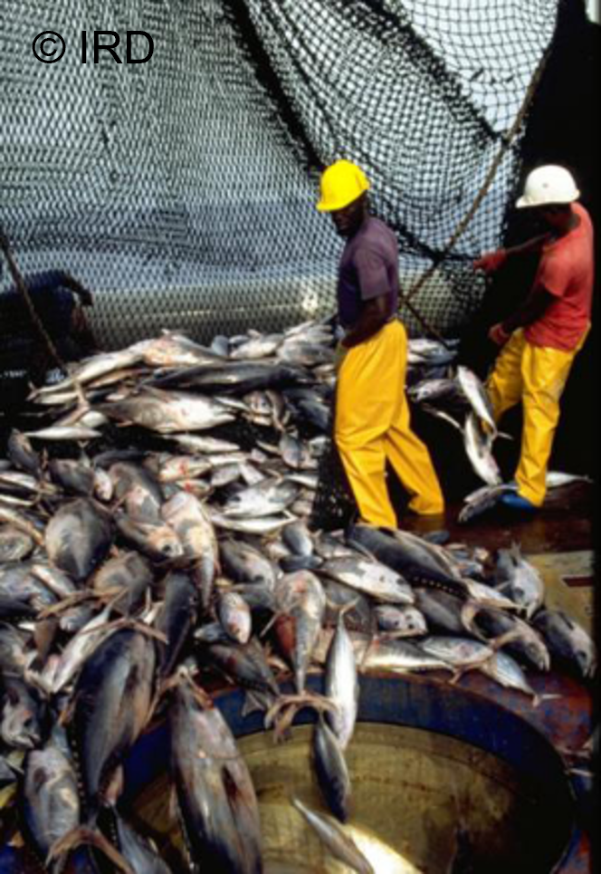{.absolute top="200" left="800" width="20%"}
:::
:::

## Purse seine fisheries' specificities

::: columns
::: {.column width="50%"}
-   [**Multispecific catches**]{style="color:#9a1c1f"}: major tunas, minor tunas and bycatch
-   Large amount of [**non-sorted catch**]{style="color:#9a1c1f"}
-   [**Misclassification**]{style="color:#9a1c1f"} among species: similarity between YFT and BET juveniles
-   Mix of [**several sets in wells**]{style="color:#9a1c1f"}

[**A sample = a mix of species and sets in a well**]{style="color:#9a1c1f"}
:::

::: {.column width="50%"}
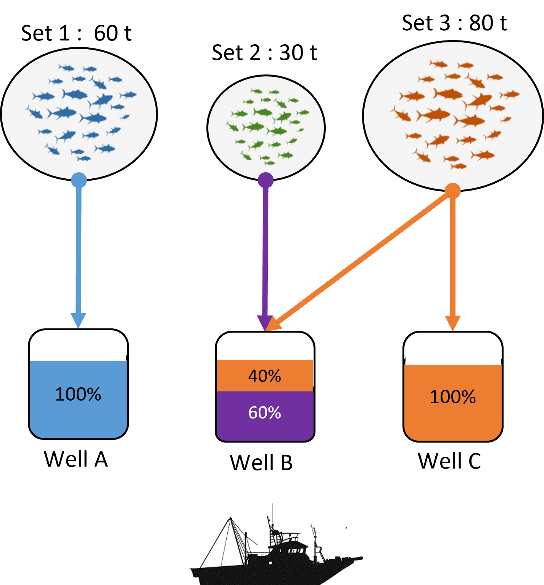{width="80%"}
:::
:::

## Data collection {.smaller}

::: columns
::: {.column width="33.3%"}
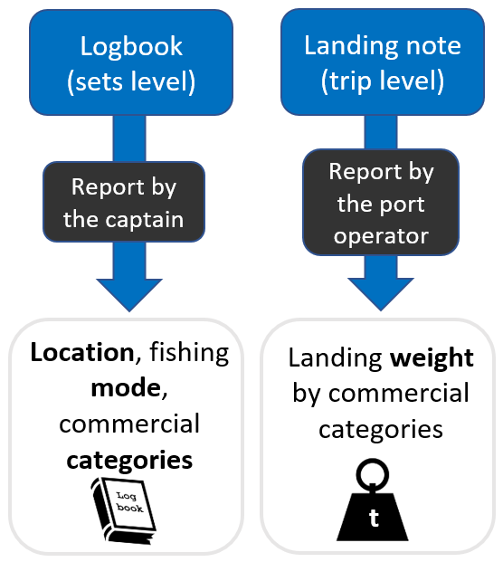{width="80%"}
:::

::: {.column width="33.3%"}
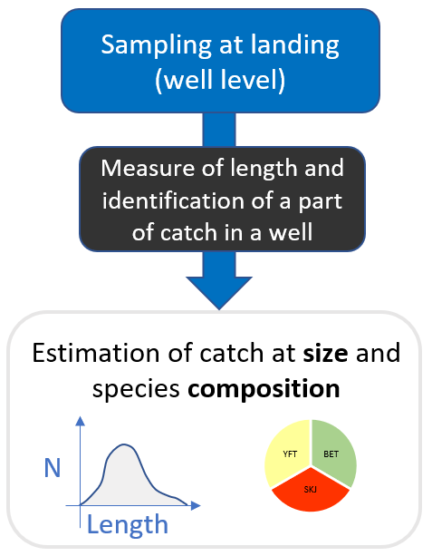{width="80%"}
:::

::: {.column width="33.3%"}
[**Protocole principle**]{style="color:#9a1c1f"}

-   Wells selected with quality criteria (homogeneity in fishing mode and composition spatio-temporal limitation)
-   Identify: 500 fishes for log school and 200 fishes for free school
-   Length measure: Number vary with species composition
:::
:::

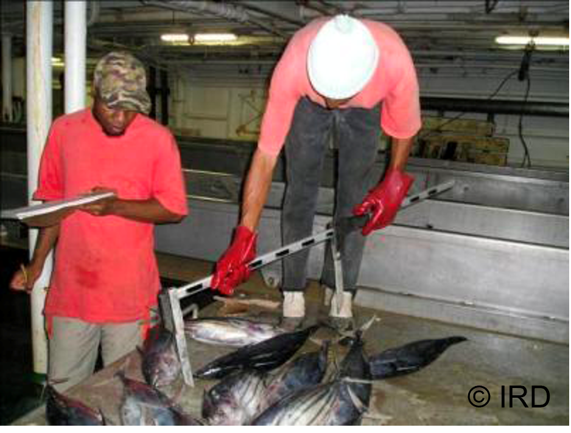{.absolute top="400" left="750" width="25%"}

## Data processing

### [Tropical Tuna Treament (T3)]{style="color:#00a9d6"}

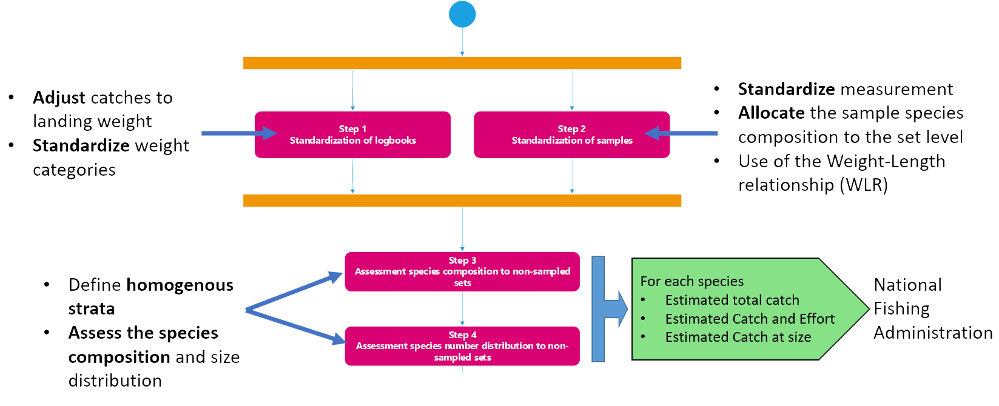

## Tropical Tuna Treament part 1

### [Outputs examples]{style="color:#00a9d6"}

::: columns
::: {.column width="33.3%"}
Length-weight relationship 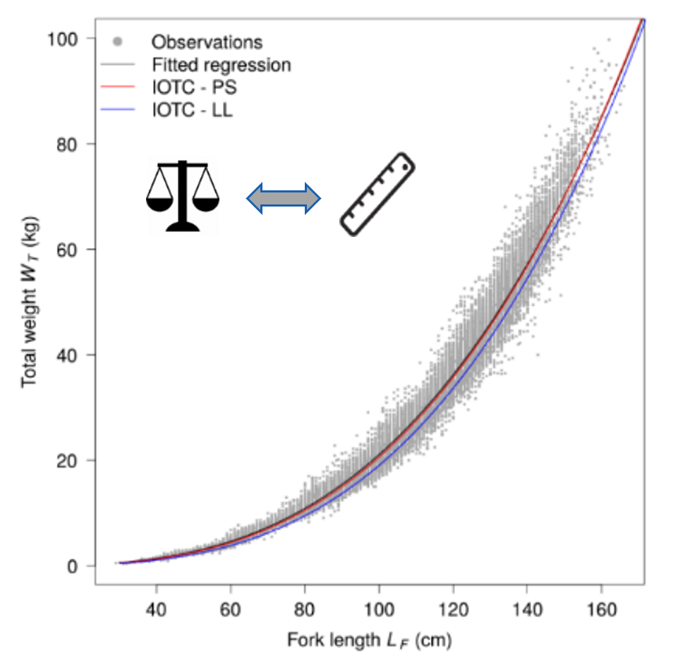{width="80%"}
:::

::: {.column width="33.3%"}
Observed values <br/> <br/> 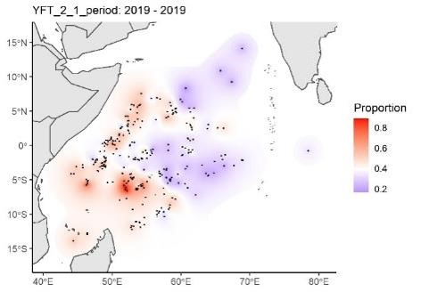
:::

::: {.column width="33.3%"}
Fitted values <br/> <br/> 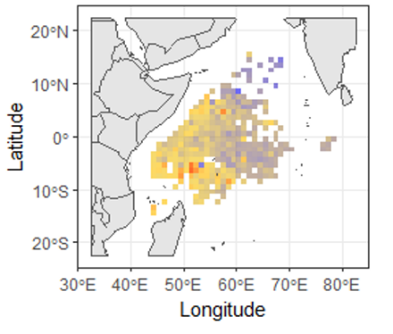
:::
:::

## Tropical Tuna Treament part 2

### [Outputs examples]{style="color:#00a9d6"}

::: columns
::: {.column width="33.3%"}
Estimated total catch <br/> <br/> 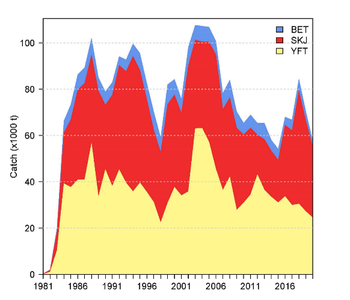
:::

::: {.column width="33.3%"}
Estimated Catch and Effort 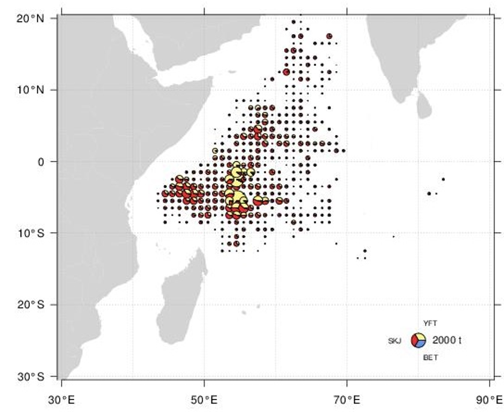
:::

::: {.column width="33.3%"}
Size distribution (YFT-2020) 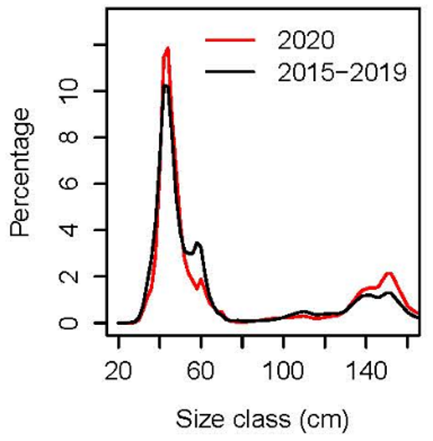
:::
:::

## Tropical Tuna Treament part 3 {.smaller}

### [Development processing]{style="color:#00a9d6"}

::: columns
::: {.column width="60%"}
-   [**T3 r package**]{style="color:#9a1c1f"}
    -   [**Transparency process**]{style="color:#9a1c1f"}: code fully documented associated to documentations
        -   [https://ob7-ird.github.io/t3/](https://ob7-ird.github.io/t3/){target="_blank"}
    -   [**Open access and source**]{style="color:#9a1c1f"}: code hosted on a github repository under GPL 3 version licence
        -   [https://github.com/OB7-IRD/t3](https://github.com/OB7-IRD/t3){target="_blank"}
        -   Referencing of the software: enable result reproducibility and versioning version 1.0.0 - DOI: 10.5281/zenodo.3878125
        -   Easier access for development to every group member
:::

::: {.column width="40%"}
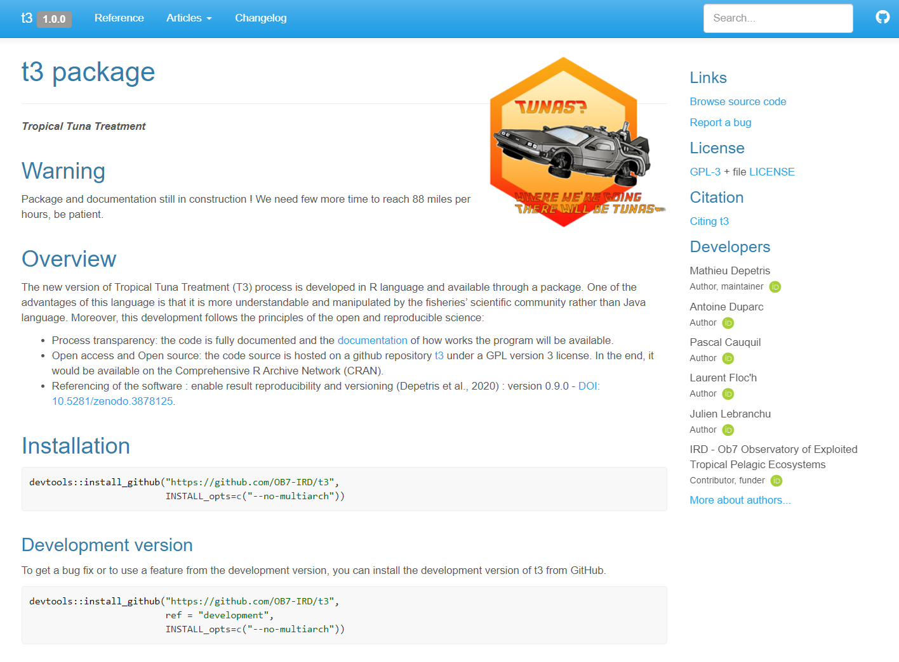{.absolute top="50" left="625" width="40%"} 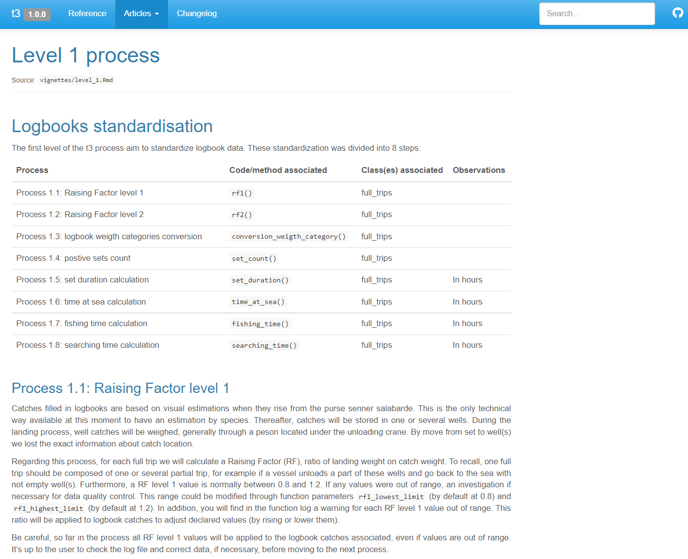{.absolute top="225" left="680" width="35%"}
:::
:::

##  {background-image="images/end_page.png"}

<br/> <br/> [Thank you for your attention,<br/> do you have any questions?]{style="color:#ffffff; font-size: 2.5em"}

{.absolute top="510" width="10%"} {.absolute top="515" left="150" width="12%"} {.absolute top="530" left="300" width="14%"} <br/> <br/> <br/> <br/> <br/> <br/> <br/> <br/> [© FADIO / IRD - Ifremer]{style="color:#ffffff; font-size: 0.4em"}

# Jeu de rôle

## Simulation d'une réunion du RCG LP {.smaller}

-   Normalement réunion en anglais, la pour simplifier on passe en français
-   Contenu et aide disponible dans le repertoire "role_play_rcg" du [Github](https://github.com/OB7-IRD/training_aerme){target="_blank"} de la formation
-   Déroulement de la simualtion :
    -   Création des groupes et distribution des fiches d'identité de chaque pays - 5min
    -   Présentation du contexte, ouvertures et des éléments support pour vos discussions - 10min
    -   Discussion en groupe - 15min
    -   Discussions entre les participants - 30min
    -   Débriefing et comparaison avec la réalité - 30min

# Création des groupes et distribution des fiches d'identité de chaque pays

[5min]{style="color:#00a9d6; font-size: 1.5em"}

# Présentation du contexte, ouvertures et des éléments support pour vos discussions

[10min]{style="color:#00a9d6; font-size: 1.5em"}

## Contexte {.smaller}

-   [**RCG**]{style="color:#9a1c1f"} : "Regional Coordination Group", [groupe de coordination régional](https://www.fisheries-rcg.eu/){target="_blank"}
-   [**Objectifs**]{style="color:#9a1c1f"}
    -   améliorer la [**coordination**]{style="color:#9a1c1f"}, au sens large et au niveau [**européen**]{style="color:#9a1c1f"}, de le collecte de données associé aux pécheries
    -   Intermédiaire entre le niveau "[**national**]{style="color:#9a1c1f"}" et "[**internationnal**]{style="color:#9a1c1f"}"
    -   Passage d'une dynamique "[**nationale**]{style="color:#9a1c1f"}" à une dynamique "[**regionale**]{style="color:#9a1c1f"}"
-   6 actuellement en activité
    -   RCG NANSEA : Groupe de coordination régionale pour l'Atlantique Nord, la mer du Nord et l'Arctique oriental.
    -   RCG Baltic : Groupe de coordination régionale pour la Baltique.
    -   RCG Med&BS : Groupe de coordination régionale pour la Méditerranée et la mer Noire.
    -   RCG ECON : groupe de coordination régionale sur les questions économiques et groupe pan-régional qui s'occupent de la collecte de données socio-économiques.
    -   [**RCG LP**]{style="color:#9a1c1f"} : groupe de coordination régionale pour les grands pélagiques.
    -   RCG LDF : groupe de coordination régionale pour la pêche à longue distance.
-   [**Composé**]{style="color:#9a1c1f"} des pays européens concernés par la thématique, des utilisateurs finaux des données et des pays tiers

## Sujet

-   Votre objectif
    -   Trouver un [consensus]{style="color:#9a1c1f"} sur le développement d'une [base de données régionale]{style="color:#9a1c1f"} pour le RCG LP
    -   Pour simplifier on oublie tous les [aspects techniques]{style="color:#9a1c1f"} liée aux bases de données
-   Axe [principal]{style="color:#9a1c1f"}
    -   Volonté commune d'[avancer]{style="color:#9a1c1f"} sur le sujet
    -   N'oubliez pas d'être [bienveillant]{style="color:#9a1c1f"} et [constructifs]{style="color:#9a1c1f"} entre vous !

## Pour vous guider

### [Agenda de la réunion]{style="color:#00a9d6"}

-   Choix du système (RDBES/RDBFIS/Autre système)
-   Quels investissements humain et financier pour chaque pays ?
-   Plan d'action (court, moyen et long terme)
